# Summary

The repository is a fork of the Ray-Tracing engine me and my team built in the 2024-2025 edition of the TU Delft course CSE2215: Computer Graphics. The following is the report of all of the features implemented, along with images of the results.

## Computer Graphics Project Standard Features Report Group 29

Members:
Veaceslav Guzun
Cristina Mitu
Boyan Bonev

## Section 1: Shading models

Description: To compute the linear gradient model, we calculate the cosine of the angle
between the light direction and the surface normal. This value is then used for sampling: we find
the two closest values that correspond to gradient components and blend their colors using
linear interpolation.

Rendered images:

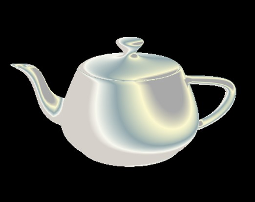
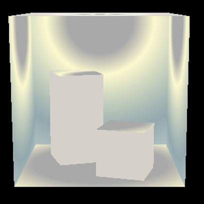

Location: The feature is implemented in the methodsLinearGradient::sample()and
computeLinearGradientModel()in the fileshading.cpp.

### Visual debug tasks and reflection tasks

To illustrate the difference between the models, I computed the specular term for each, showing
high differences in red and no differences in blue. At least two high-contrast colors are needed
for the comparison.


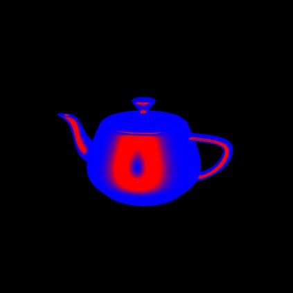
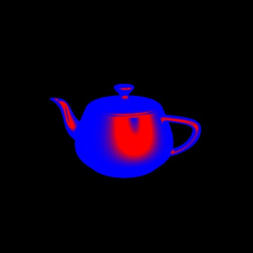


## Section 2: Recursive ray reflections

Description: Every time a ray intersects a specular surface, a mirror reflectance ray is
generated. This allows us to render mirror-like surfaces. To find the reflection of rays, we apply
the following formula: r=d−2(d⋅n)n, where r is the resulting reflected ray, n is the surface normal
of the point and d is the incident ray. Also, we add a small bias to the hitLocation along the hit
normal, because otherwise artifacts and self-intersections happen, and the resulting ray goes in
a different direction. We calculate the reflected ray and go deeper into the recursion to calculate
the resulting reflection, to add it to the color of the currently hit surface.

Rendered images:

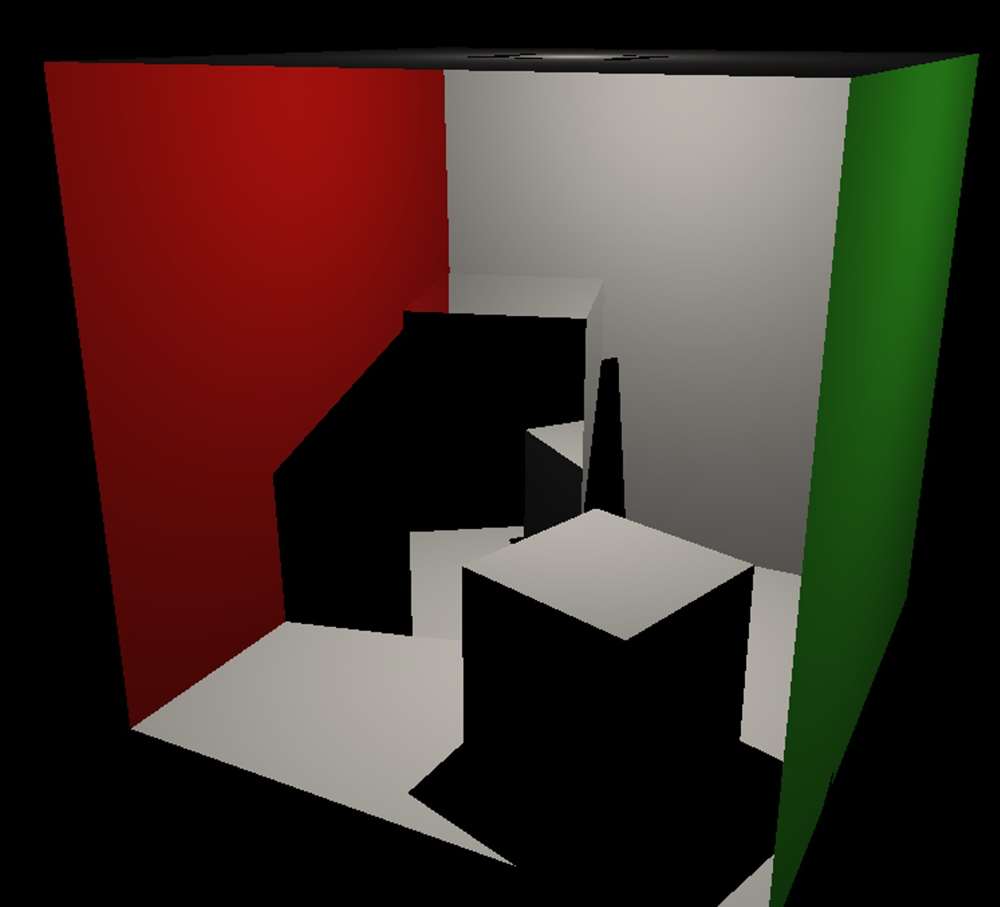
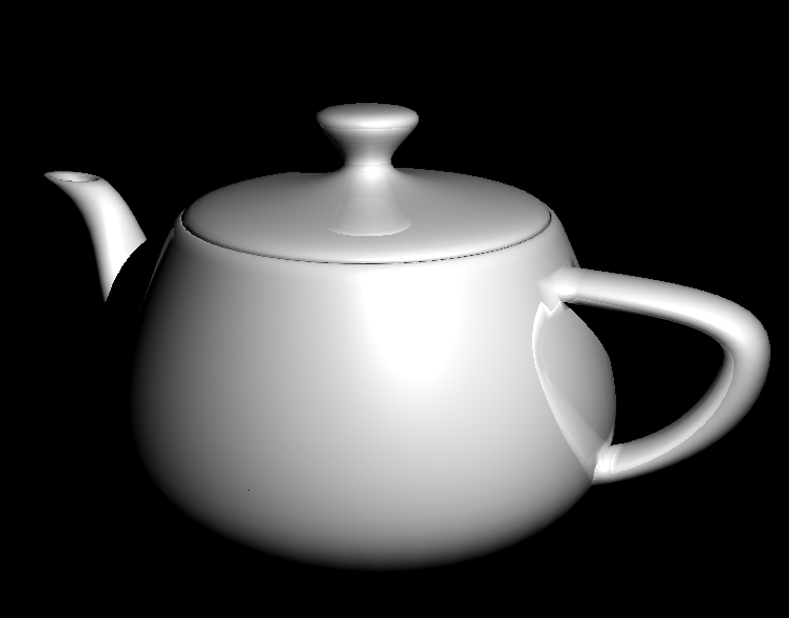

Location: The feature is implemented in the methodsvoid
renderRaySpecularComponent(RenderState& state, Ray ray, const HitInfo& hitInfo,
glm::vec3& hitColor, int rayDepth)andRay generateReflectionRay(Rayray, HitInfo
hitInfo)in the filerecursive.cpp.


### Visual debug tasks and reflection tasks

To illustrate the reflected ray, a ray with length 0.2 and a yellow color. The initial ray is white and
all next reflected rays (secondary rays) are illustrated as a darker shade of red.

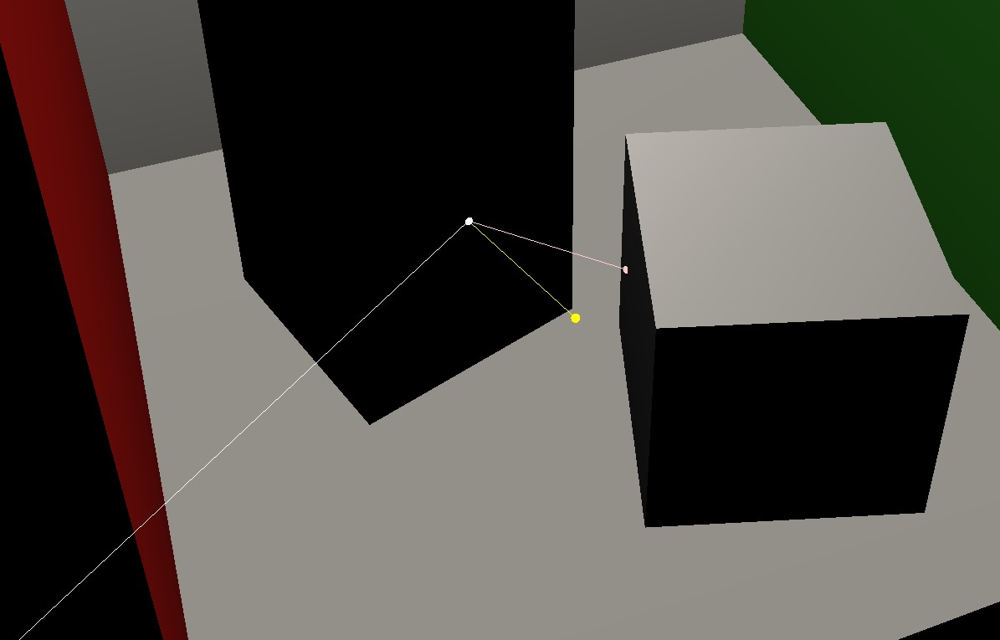
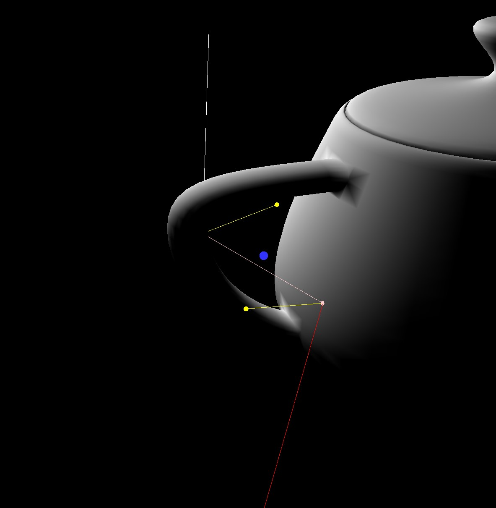

## Section 3: Recursive ray transparency

Description: The transparency feature allows rendering of transparent objects. Every time a ray
intersects a transparent surface, it continues along the ray, evaluates its contribution, and
correctly alpha-blends the results. The passthrough ray does not change its direction, we only
change its origin. We also add a small bias based on the direction of the incident ray, so we
avoid self-intersections. We pass the new ray to the renderRay method and we update the
resulting color based on the transparency value of the hit material.

Rendered images:

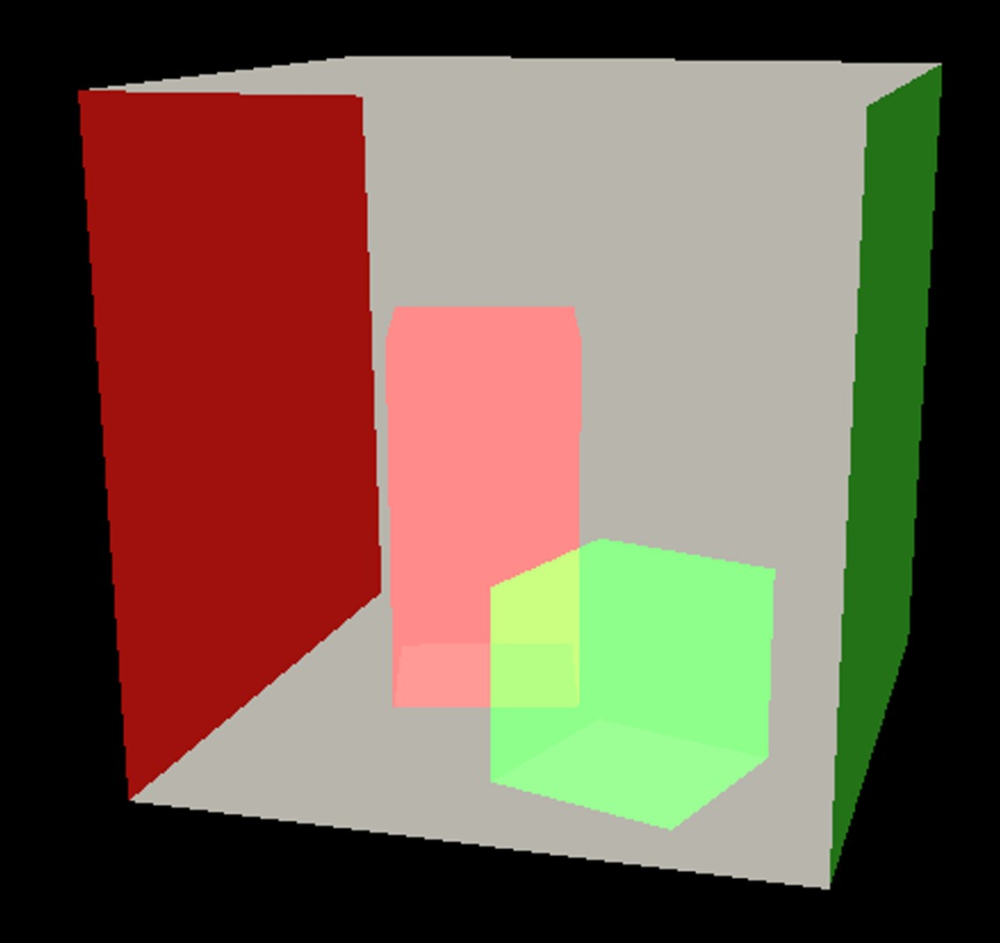


Location: The feature is implemented in the methodsvoid
renderRayTransparentComponent(RenderState& state, Ray ray, const HitInfo& hitInfo,
glm::vec3& hitColor, int rayDepth)andRay generatePassthroughRay(Rayray, HitInfo
hitInfo)in the filerecursive.cpp.


### Visual debug tasks and reflection tasks

To illustrate the passthrough rays, a sphere is drawn at each hit location with the color of the
material being hit at the origin of the new ray, accounting for the transparency value. Also, a new
ray is being drawn with the color it has passed through.

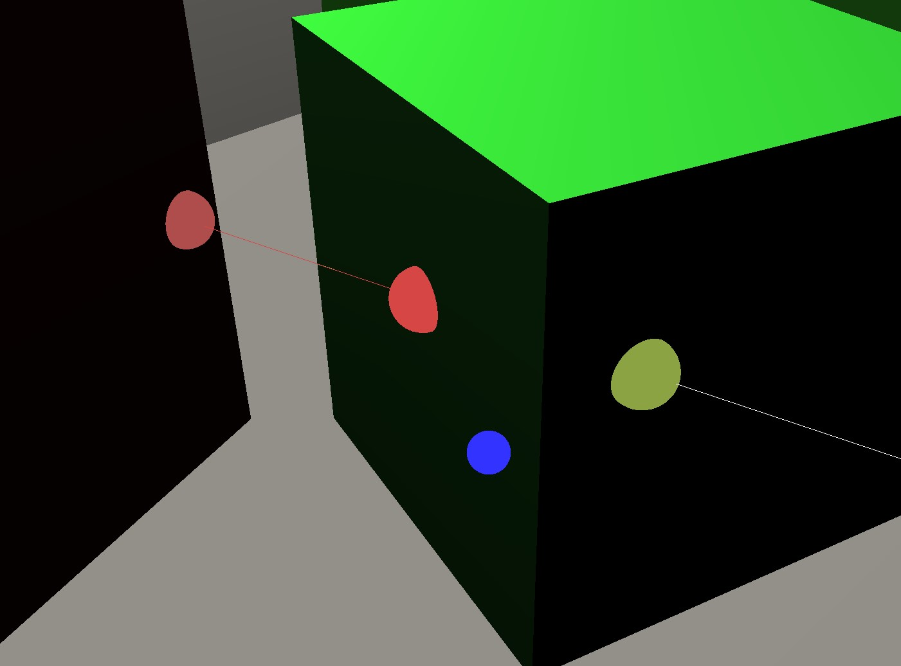
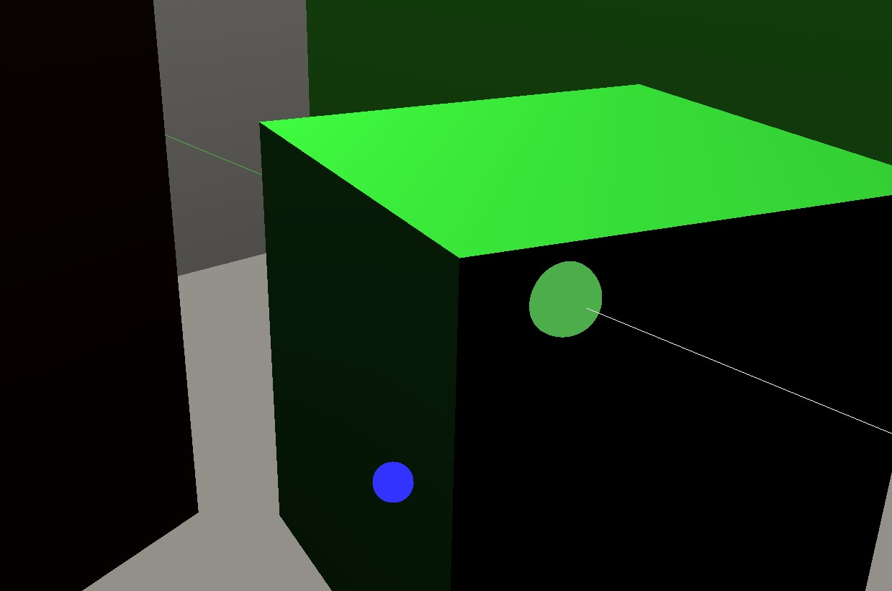

## Section 4 & 5: Interpolation and BVH

Description: Our project performs ray traversal in order to find intersection points using a
bounding volume hierarchy, which improves the rendering times in ray tracing mode and in
generating images multiple times. Our implementation follows the provided steps when going
down the bounding volume hierarchy, using a stack data structure.

Location: The feature is implemented in the methodsbool BVH::intersect(RenderState&
state, Ray& ray, HitInfo& hitInfo), glm::vec3 computeBarycentricCoord(const glm::vec3&
v0, const glm::vec3& v1, const glm::vec3& v2, const glm::vec3& p), glm::vec
interpolateNormal(const glm::vec3& n0, const glm::vec3& n1, const glm::vec3& n2, const
glm::vec3 bc), glm::vec2 interpolateTexCoord(const glm::vec2& t0, const glm::vec2& t1,
const glm::vec2& t2, const glm::vec3 bc)in the filesbvh.cpp, interpolate.cpp.

### Visual debug tasks and reflection tasks

To illustrate ray going through the BVH structure, we draw all the intersected AABBs in red, with
increasing intensity. The AABBs that are not intersected, but are iterated through, are drawn in
white. Also, the intersected primitive triangle and intersection point is also drawn.

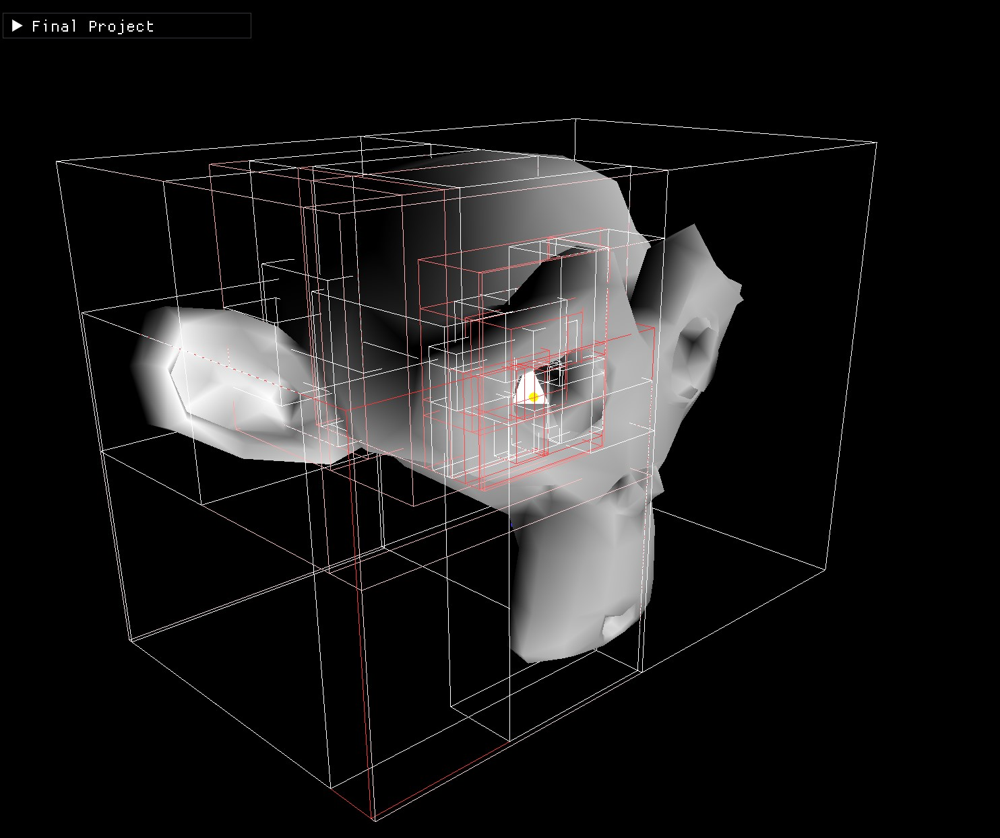
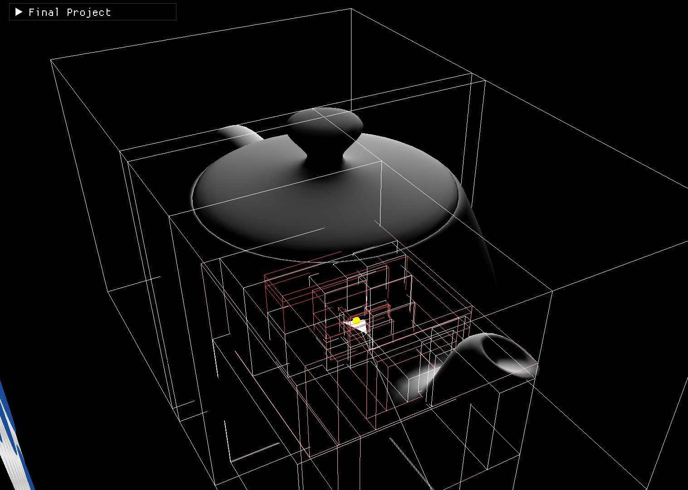


## Section 6: Texture Mapping

Description:Texture mapping consists of being able to add a texture to 2d/3d objects, and for
this we need to sample the nearest texture and be able to bilinearly interpolate for smoother
ends. To sample the texture, we map the space from the texture coordinates which are in [0, 1]
to the image width/height, by multiplying the texture coordinate with the width/height. Then we
convert to an index as in lectures, considering how many full columns we have and then adding
the final row position. To bilinearly interpolate the texture, we first obtain the coordinates of the 4
closest cells (which are based on the cell the actual point is on and on the distance from the
center of the point. Then we interpolate based on the distance ratio, first twice horizontally, and
then vertically

Rendered images:

Only sampling nearest:

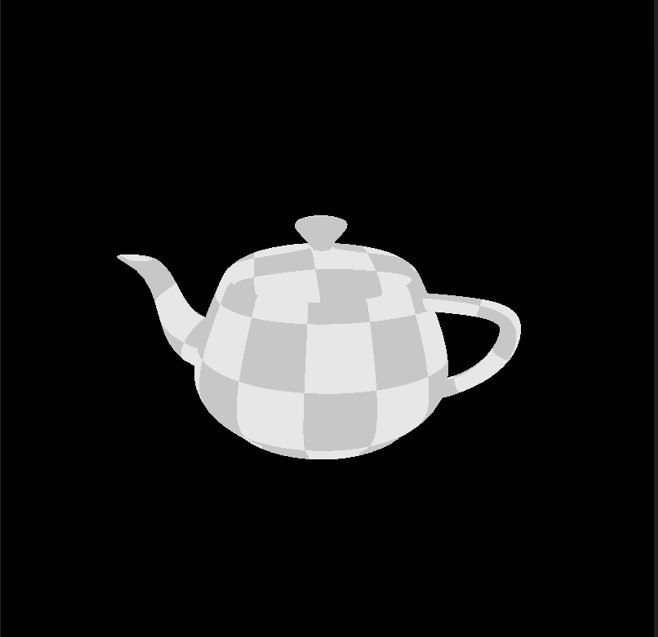
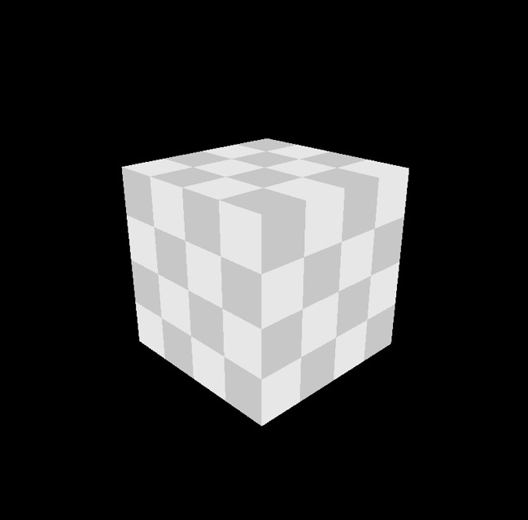


With Bilinear interpolation:

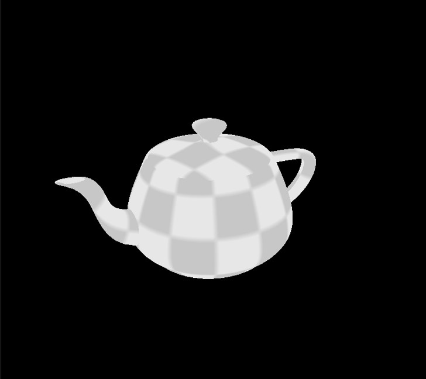
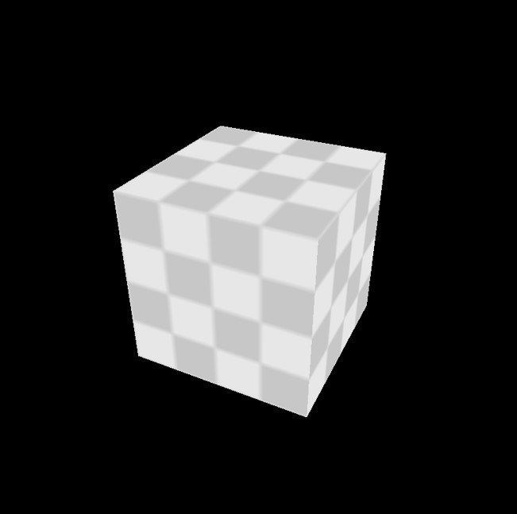

Location: The functions are implemented as glm::vec3 sampleTextureNearest(const
Image& image, const glm::vec2& texCoord)andglm::vec3 sampleTextureBilinear(const
Image& image, const glm::vec2& texCoord)in the filetexture.cpp

## Visual debug tasks and reflection task

- Implement a view of the texture space and how the geometry is mapped into it. Highlight the
ray intersection position as well as the involved pixels from texture space.

In order to visually debug, we draw a 2d 1x1 square and map the texture on it, we do so by going
through the whole texture and drawing width * height small cells which we color as the color of
the corresponding pixel. Then to plot the shape on the texture space we go over all triangles from
all meshes and draw only their sides using the texture coordinates of the vertices. To see where
the ray hits, we draw a sphere with the corresponding texture coordinates. This way, we can see
exactly which part of the texture is responsible for the exact point on an object.

Images:

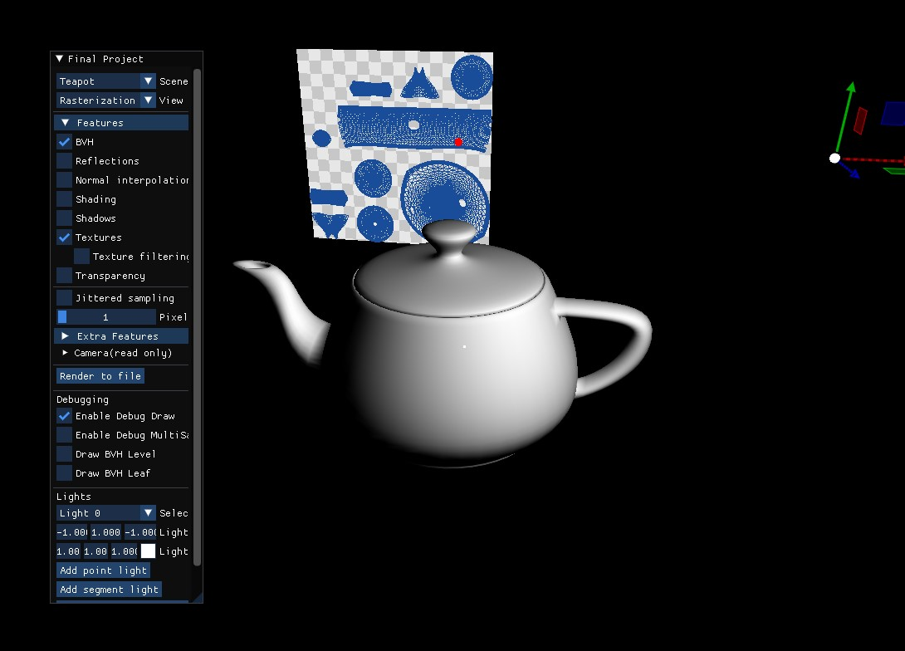
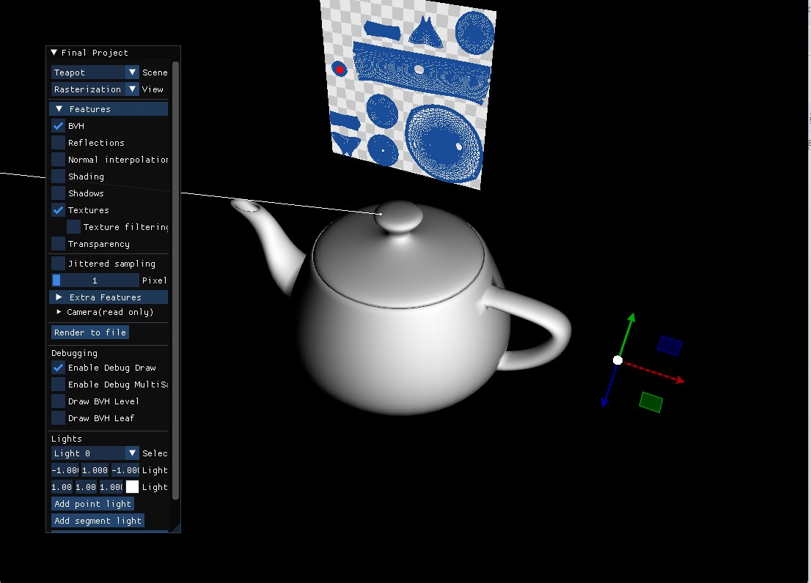

Location:The functions used for the visual debugging are:

1. void drawTextureForm(const HitInfo& hit_info, const Scene& scene) implemented in
    drawp.cpp, and added to draw.h
2. glm::vec3 sampleMaterialKd(RenderState& state, const HitInfo& hitInfo) implemented in
    shading.cpp


# Section 7: Lights and shadows

Description:To compute the light contribution, the implementation follows the steps provided: it
takes multiple samples from the light sources, using linear or bilinear interpolation for segment or
parallelogram lights, respectively. Then, for each sample, it checks if the ray hits any objects
using the BVH implementation. If the sample is not blocked, it calculates shading based on the
object's material at the hit point. The final light contribution is the average of all shading results
from all samples.

Rendered images:


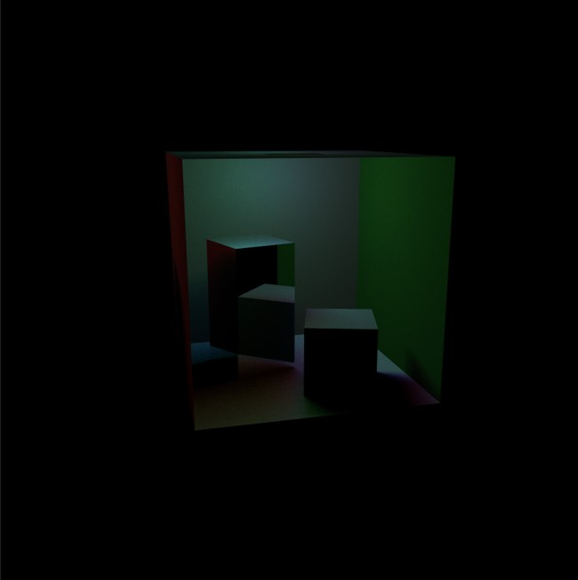
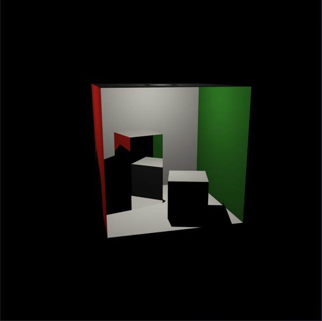
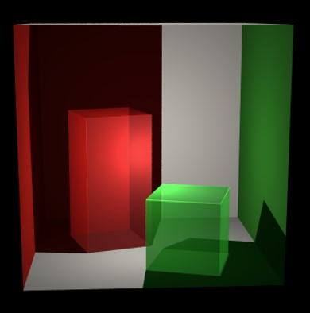

Location:The feature is implemented in the methods:sampleSegmentLight(),
sampleParallelogramLight(), visibilityOfLightSampleBinary(),
visibilityOfLightSampleTransparency(), computeContributionPointLight(),
computeContributionSegmentLight(), computeContributionParallelogramLight() in the file
light.cpp

## Visual debug tasks and reflection tasks-drawn in thelight.cppfile (marked with comments

// visual debug)

1. Visualize visibility rays and whether or not these pass/fail, as well as a
    visualization of the transparency.In the first image, the ray is traced from the light
    source to the top of the cube, where the light is visible (thus, the ray rendered is green);
    in the second image, the ray is traced from the light source to the front of the cube,
    where the light is blocked by the cube (thus, the ray rendered is red). When transparency
    is enabled, the ray passes through the cube, as seen in the last image.
   
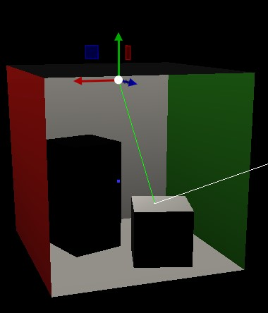
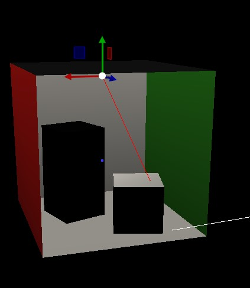
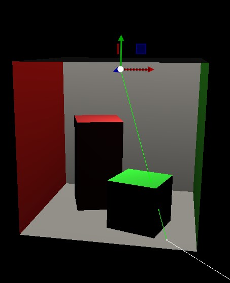

2. Visualize the samples generated on your segment/parallelogram light, to verify
    they are uniformly distributed across the light.

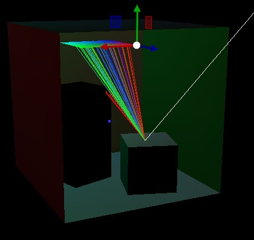
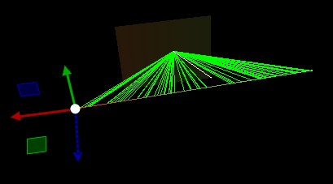

#### 3. Compare samples drawn with the provided sampler for 2D to the samples that you

```
obtain by choosing both coordinates of a sample with the 1D random sampling.
What do you observe?The 2D sampler clusters rays near the parallelogram's edges,
unlike the more uniform distribution seen in the second image.
```

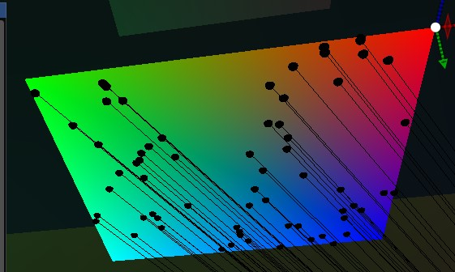
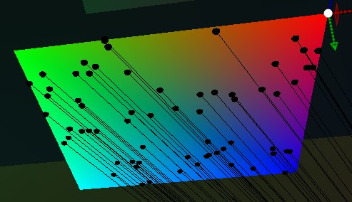

4. Reflect within 50 words in your report on why the blending operation used in the
    function is incorrect, based
    on the alpha blending derivation in the course. What would you propose how this


```
could be modified? Illustrate an example of what is incorrect and, if possible, your
proposal.Using the provided formula for each transparent layer that the ray hits, we get
the final color computed as color = lightColor * kd 1 * kd 2 * ... * kdn* (1 - transparency 1 ) *
(1 - transparency 2 ) * ... * (1 - transparencyn), where n is the number of transparent
surfaces. This formula does not account for the order in which the ray hits the materials
since multiplication is commutative. This is an issue, as the order matters in alpha
blending (as seen in the example below). To fix this, we can use the formula: color =
transparency * kd + (1 - transparency) * lightColor, which considers both the material's
effect and the remaining light after passing through previous surfaces.
```

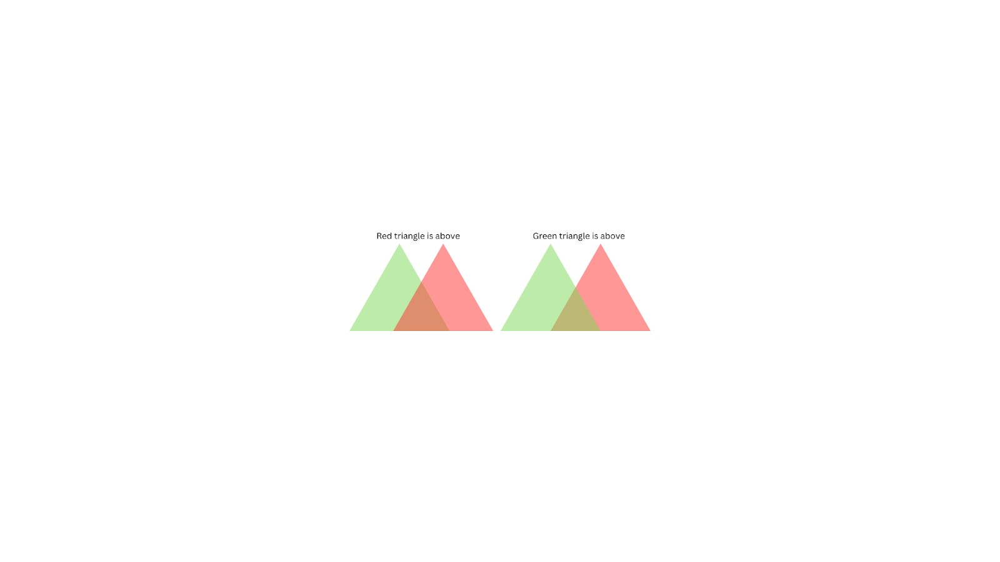
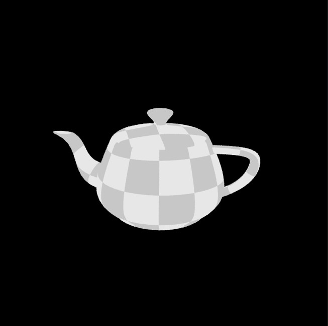

## Section 8: MultiSampling

Description:We use multisampling to reduce aliasing on the edges We do so by extending the
multisampling function in 2 parts: uniform and jittered. For the uniformly distributed we will
generate random numbers in range [0, 1] and displace the pixel coordinates by this number.
Repeating this process numSamples times will ensure a uniform distribution as numbers are
generated totally randomly. To jittery spread the pixel rays we will generate randomly a point in
each cell of the pixel. We do so by splitting over numSamples * numSamples cells, and for
each, generating a random displacement and displacing the pixel by this amount.

Rendered images (Smoother corners):


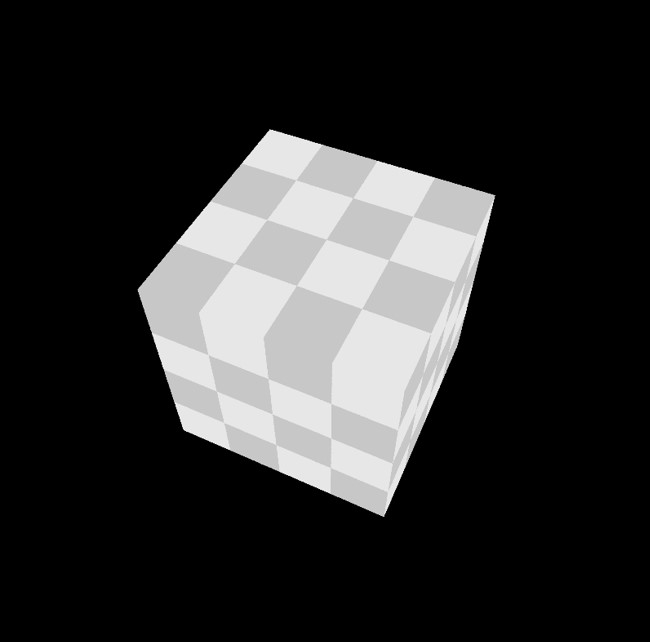
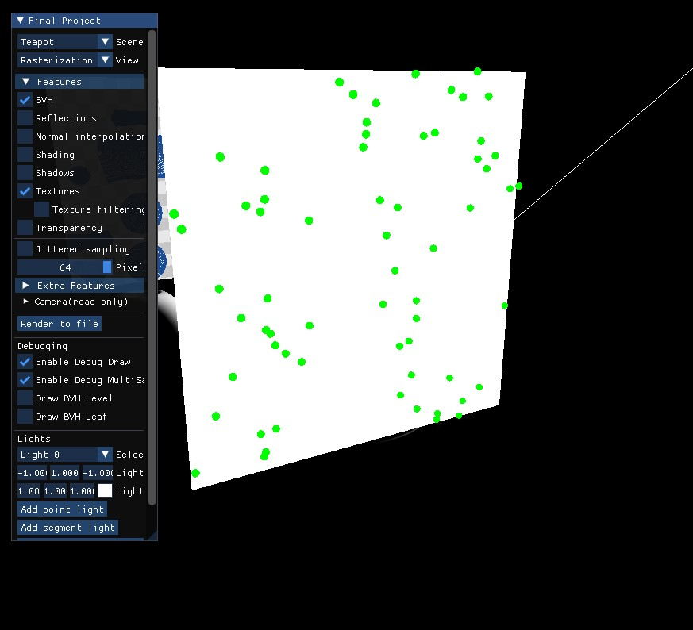


The first image with the teapot uses uniform distribution sampling while the cube uses the
jittered sampling.

Location:The functions are implemented asstd::vector<Ray>
generatePixelRaysUniform(RenderState& state, const Trackball& camera, glm::ivec
pixel, glm::ivec2 screenResolution)andstd::vector<Ray>
generatePixelRaysStratified(RenderState& state, const Trackball& camera, glm::ivec
pixel, glm::ivec2 screenResolution)in the filerender.cpp

## Visual debug tasks and reflection tasks

Provide visualizations of the sample distribution within a pixel for the different approaches by
drawing the grid over a pixel plus the respectively sampled positions.

Here is an example for the uniform distribution

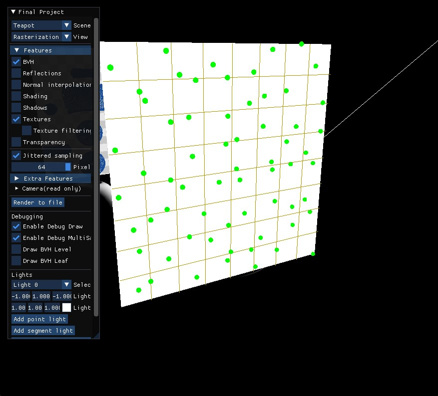

Here is an example for the stratified distribution (notice 1 point is randomly selected in
each square separated by lines)

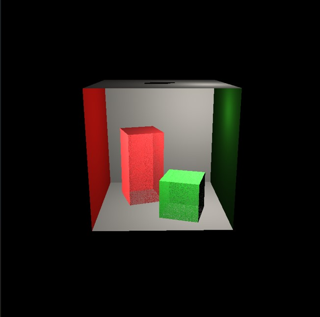


We can notice that the stratification ensures a bit more overall balance of the points since each
point is more overall balanced, ensuring smooth ends and is more predictable. While, the jittered
sampling is a bit more random since it selects a point randomly from each square, and it is
better in order to reduce visual artifacts which the more balanced and smoother techniques
might not be able to.

Location:

- Function main in main.cpp, and Struct Features in common.h for adding a button to
    enable the multisampling debugging, and a new state option.
- Functions drawSquare and drawLine in draw.cpp (and draw.h respectively) in order to aid
    the drawing process.
- Function visualizeMultiSampling in render.cpp to actually visualize (it is called from
    main.cpp)

Provide visualizations of a scene for the different multisampling strategies and discuss the
differences.

No multisampling
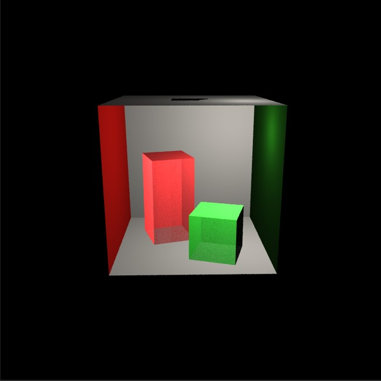

Uniform multisampling
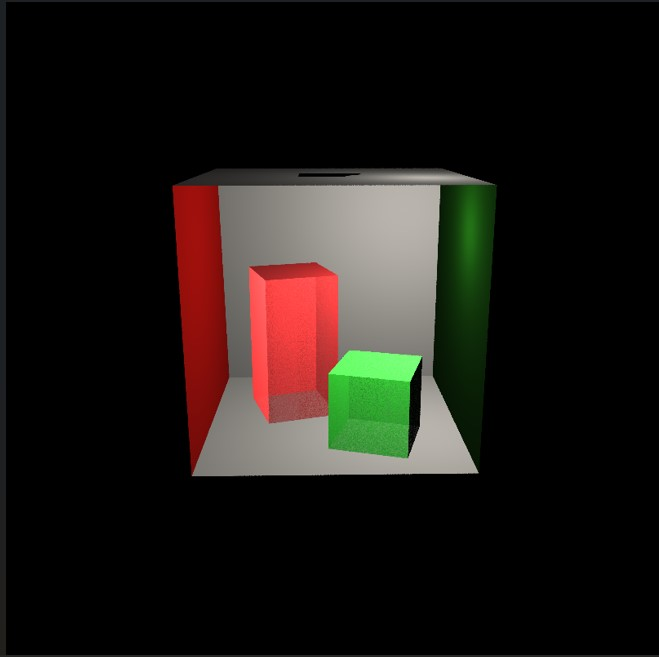

Stratified multisampling


First of all, we can notice a big difference in the smoothness of all the walls with no
multisampling compared to any multisampling. Now, the walls are smoother for the uniform
multisampling, and for the jittered it is mostly smooth but we can notice sometimes the patterns
stop and have some outliers. In this scenario, the uniform multisampling would be the best
choice. And clearly, no multisampling has the edges very rough and pixelated (but takes much
shorter to render).


